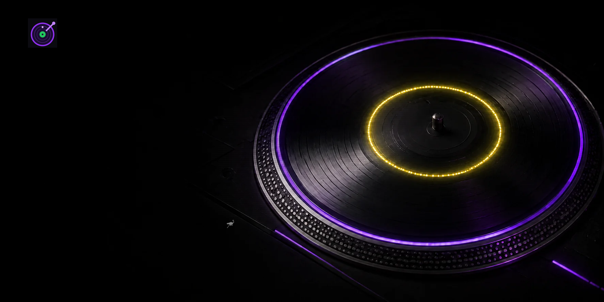

# zapclub.io

[](https://zapclub.io)

Decentralized social music streaming with Nostr identities, NIP-29 clubs,
Lightning zaps and synchronized YouTube playback.

This README is the authoritative product and architecture concept. The current
production and release plan lives in [`deploy/README.md`](deploy/README.md).

- Frontend: `https://zapclub.io`
- Relay: `wss://relay.zapclub.io`
- UI language: English only

## Architecture

```text
Browser (Svelte 5) ── NIP-07/46 ── Nostr signer
        │
        ├── HTTPS/WSS ── Caddy ─┬── static frontend
        │                       ├── NIP-29 relay + conductor
        │                       └── LNURL/NIP-05 proxy
        ├── YouTube IFrame API
        └── NIP-57 ── Lightning zaps to DJs

Telegram ── bridge bot ── NIP-29 relay
```

The relay is the authoritative shared-state component. It manages group
membership and roles, enforces write permissions and limits, and acts as the
always-on playback conductor. Profiles and zap receipts remain on public Nostr
relays. Caddy terminates TLS and serves the frontend; the remaining services are
small adapters without application state.

## Event model

All club content carries an `h` tag. NIP-29 metadata is queried separately by
`#d`; relay29 rejects subscriptions that mix metadata kinds with content kinds.

| Kind | Purpose |
|---|---|
| `9007`, `9002`, `9008` | Create group, edit metadata, delete group |
| `9000`, `9001`, `9005`, `9021`, `9022` | Roles, kick, delete event, join, leave |
| `39000–39002` | Relay-signed group metadata, admins, members |
| `30100` | Relay-authored `now_playing` state |
| `30101` | Owner-authored club/access configuration |
| `30102` | DJ stage heartbeat and stable `since` ordering |
| `30103` | Parameterized-replaceable queue per DJ and club |
| `30104` | Saved user playlist |
| `30105` | Owner-authored Auto DJ configuration |
| `30106` | Stage kick marker |
| `30107` | Authorized skip request |
| `30111` | Relay-authored Auto DJ disarm marker |
| `1313` | Relay-authored playback log |
| `9`, `20100` | Chat and ephemeral presence |
| `20101` | Zap broadcast used by the leaderboard |
| `20102–20104` | Broken-track report, floor reaction and mood vote |
| `9734`, `9735` | NIP-57 zap request and receipt |

Nostr `created_at` values use seconds. Playback timestamps (`started_at`,
`sent_at`) and all client calculations use milliseconds.

## Playback conductor

Only the relay signs and stores `30100` and `1313`. Browsers are consumers and
never participate in leader election. For each club, the conductor:

1. indexes active stage events and DJ queues;
2. interleaves playable tracks round-robin;
3. publishes a new `now_playing` event on track changes;
4. republishes it roughly every 15 seconds with a fresh `sent_at`;
5. advances on duration, authorized skip, broken-track quorum or mood threshold.

DJ order is determined by the persisted `since` value in the newest `30102`
event. A stage slot remains sticky for at most five minutes after the last
heartbeat. When no staged DJ has a playable queue, the stream returns to the
lobby track.

Round-robin uses a global position:

```text
djIndex    = pos % djCount
trackIndex = floor(pos / djCount)
```

Tracks marked `off` are masked. For offline DJs without a recent presence beat,
a persisted played-set prevents old queues from looping indefinitely.

## Client synchronization

Clients derive their target playback position from the relay heartbeat:

```text
offsetMs = sent_at - Date.now()
targetMs = Date.now() + offsetMs - started_at
```

The player loads at `targetMs`. Every five seconds it compares local playback
with the target and seeks when absolute drift exceeds three seconds.

Auto-DJ `now_playing` heartbeats also carry repeated `next` tags. They expose
the relay's preplanned shuffled order so every client's “Up next” preview
matches the tracks the conductor will actually play.

## Storage

BadgerDB is the Nostr event store and source of truth. SQLite contains derived
state for constant-time hot-path lookups:

| Table | Data |
|---|---|
| `conductor_state` | Current position, video, DJ and start time per club |
| `played` | Offline-DJ played-set |
| `club_owners` | Immutable club creator lookup |

`modernc.org/sqlite` is pure Go, so Linux binaries remain static without CGO.
The SQLite database can be rebuilt from events, but `SQLITE_PATH` should persist
across deployments to avoid a cold-start scan.

Ban state, listener analytics and the zap leaderboard are stored as small JSON
sidecars in the same persistent directory. Releases contain no mutable state.

## Enforcement and security

- Group content is writable only by current members.
- `30100` and `1313` are accepted only from the relay key.
- Club and stage limits are enforced by relay hooks.
- Private and entry-fee clubs are relay-gated.
- NIP-42 authentication protects writes; public reads remain available.
- Admin endpoints require fresh NIP-98 authorization.
- Chat, search and HTTP endpoints are rate-limited.
- The relay listens on `127.0.0.1` behind Caddy/TLS.
- `RELAY_SECRET_KEY` is persistent, mode `600`, and never committed.

Important relay29 constraints:

- Keep relay29 pinned to the known-good `master` revision.
- Register `db.ReplaceEvent`, otherwise addressable events accumulate.
- Never mix kinds `39000–39003` with content kinds in one subscription.

## Repository layout

```text
frontend/      Svelte 5 / TypeScript client
relay/         Go NIP-29 relay and conductor
telegram-bot/  Telegram integration
deploy/        sunnyhill Caddy, systemd, monitoring and backup configuration
```

## Local development

Requirements: Node.js 22/npm, Go 1.26 and `yt-dlp`.

```sh
cd frontend
npm ci
npm run dev
```

```sh
cd relay
relay_state="$(mktemp -d)"
export RELAY_SECRET_KEY="$(openssl rand -hex 32)"
export RELAY_DB="$relay_state/db"
export SQLITE_PATH="$relay_state/conductor.db"
export RELAY_BANLIST="$relay_state/banned.json"
export RELAY_LISTENERS="$relay_state/listeners.json"
export RELAY_LEADERBOARD="$relay_state/leaderboard.json"
go run .
```

The frontend defaults to the live relay. The local relay listens on
`127.0.0.1:3334` unless configured otherwise. Remove `$relay_state` after the
relay stops; no runtime state belongs in the repository.

## Test and build

```sh
cd frontend
npm run check
npm test
npm run build
```

```sh
cd relay
go vet ./...
go test ./...
./e2e.sh
CGO_ENABLED=0 GOOS=linux GOARCH=amd64 go build -o /tmp/zapclub-relay-linux .
```

```sh
cd telegram-bot
go vet ./...
go test ./...
CGO_ENABLED=0 GOOS=linux GOARCH=amd64 go build -o /tmp/zapclub-telegram-bot-linux .
```

## Installation and deployment

Production runs on `sunnyhill` as the unprivileged `zapclub` user. Each commit is
built into `/srv/zapclub/releases/<commit>` and `/srv/zapclub/current` points to
the active release. Caddy serves the frontend directly from that symlink; the
relay, LNURL/NIP-05 proxy and Telegram bot are systemd services. Persistent data
lives in `/var/lib/zapclub-relay`, secrets in `/etc/zapclub` and backups in
`/var/backups/zapclub`.

Run `./release.sh` from a clean local `main` for a complete release. It performs
all local checks, pushes the exact commit, transfers a Git bundle to the VPS,
invokes the restricted root validator and finishes with public HTTP, NIP-05 and
Nostr WebSocket smoke tests. Production is checked every five minutes by
`zapclub-monitor.timer`; failures trigger a rate-limited mail alert. Daily
backups are independently managed by `zapclub-backup.timer`.

See [`deploy/README.md`](deploy/README.md) for the authoritative file mapping,
release procedure, rollback and verification checklist.

Do not run `go get` or `go mod tidy` on the server. Dependencies are pinned in
`go.mod` and `go.sum`; build inside the new release before switching `current`.
